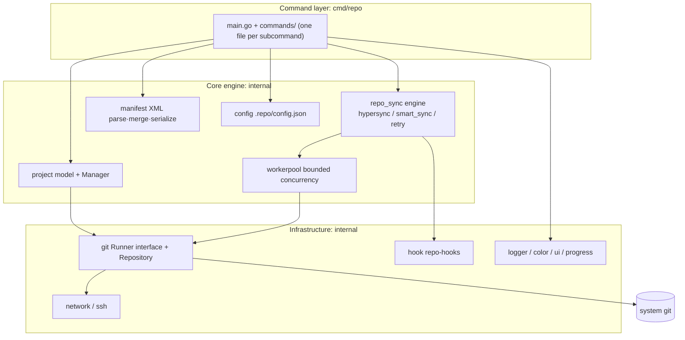

<div align="center">

# repo-go

**A high-performance Go implementation of Google's Git-Repo — manage hundreds of Git repositories with a single static binary**

[](https://github.com/leopardxu/repo-go/actions/workflows/ci.yml)
[](https://goreportcard.com/report/github.com/leopardxu/repo-go)
[](https://pkg.go.dev/github.com/leopardxu/repo-go)
[](./LICENSE)


[简体中文](./README.md) | [English](./README.en.md)

</div>

---

## Why repo-go

[Google's `repo`](https://gerrit.googlesource.com/git-repo) is the standard workflow tool for Android/AOSP and many large multi-repository projects — but it is a Python launcher plus a script bundle, which is painful to deploy on Windows and in Python-less environments. **repo-go re-implements the full multi-repo experience in Go**:

- 🚀 **Single static binary** — no Python runtime, no auxiliary files; `go install` and go, CI-container friendly
- 🪟 **Cross-platform by default** — native Linux / macOS / Windows support
- 🔁 **Upstream-compatible semantics** — every subcommand except `init` matches the user-visible behavior of upstream Python `repo`; full manifest XML feature set (`extend-project`, `remove-project`, `repo-hooks`, `superproject`, `copyfile`, `linkfile`, …)
- ⚡ **Concurrent sync engine** — bounded parallelism via a worker pool with `--jobs` / `--jobs-network` / `--jobs-checkout` and automatic backoff retry
- 🧩 **Superset features** — `hypersync`, `smartsync`, superproject, custom manifest XML attributes (not supported upstream), `selfupdate`
- 🧪 **Quality gates** — CI runs the full test suite with the Go race detector, golangci-lint, and gofmt

## Installation

```bash
# Option 1: go install (Go 1.23+)
go install github.com/leopardxu/repo-go/cmd/repo@latest

# Option 2: build from source
git clone https://github.com/leopardxu/repo-go.git
cd repo-go && make build    # produces bin/repo

# Option 3: download a prebuilt binary from Releases
# https://github.com/leopardxu/repo-go/releases
```

> The only runtime dependency is the system `git` binary.

## Quick Start

```bash
# 1. Initialize a repo client (clones the manifest repository)
repo init -u https://android.googlesource.com/platform/manifest -b main

# 2. Sync all projects (concurrent fetch + checkout with live progress)
repo sync

# 3. Start developing: create a topic branch across projects
repo start my-feature

# 4. Everyday multi-repo operations
repo status                          # dirty files across all projects
repo diff                            # cross-project diff
repo forall -c 'git gc'              # run an arbitrary shell command everywhere
repo grep TODO                       # cross-project search

# 5. Upload for code review (Gerrit workflow)
repo upload
```

Managing your own multi-repo project: write a manifest XML describing remotes and projects, then use the same commands — ideal for microservice fleets, multi-repo SDKs, or private platform builds.

```xml
<?xml version="1.0" encoding="UTF-8"?>
<manifest>
  <remote name="origin" fetch="ssh://git@example.com/" review="https://gerrit.example.com"/>
  <default remote="origin" revision="main"/>
  <project name="platform/app" path="app"/>
  <project name="platform/libs/common" path="libs/common"/>
</manifest>
```

## Commands

| Command | Purpose |
| --- | --- |
| `init` | Initialize a repo client checkout (clones the manifest repository) |
| `sync` | Sync the workspace to the latest revision (concurrent, mirror, archive modes) |
| `smartsync` | Sync to the latest known-good revision (manifest-server) |
| `start` / `checkout` | Create / switch topic branches across projects |
| `status` / `diff` / `grep` / `overview` | Cross-project status, diff, search, unpushed-work overview |
| `upload` / `download` | Gerrit review upload / fetch others' changes |
| `forall` | Run a shell command in each project (parallelizable) |
| `rebase` / `cherry-pick` / `prune` / `abandon` / `stage` | Batch branch maintenance |
| `branches` / `list` / `info` / `manifest` / `diffmanifests` | Workspace and manifest inspection |
| `selfupdate` / `version` | Self-update and version info |

Run `repo <command> --help` for the full flag reference.

## Architecture



Layered design: the command layer only parses flags and orchestrates; the sync engine and manifest parsing are independently testable; every git subprocess goes through the `git.Runner` interface (centralized retry / trace / timeout / concurrency), mocked in tests. See **[docs/architecture.md](./docs/architecture.md)** for the full design document and data-flow diagrams.

## Comparison with upstream repo

| Dimension | Google repo (Python) | repo-go |
| --- | --- | --- |
| Distribution | Python launcher + scripts | Single static binary |
| Windows | Requires a Python setup | Native; `build-windows` works out of the box |
| Subcommand semantics | Official baseline | All commands except `init` match upstream |
| Manifest parsing | Full feature set | Full feature set **+ custom XML attributes** (`CustomAttrs`) |
| Concurrency | `sync --jobs` | Worker-pool bounded concurrency with `--jobs-network` / `--jobs-checkout` |
| hypersync / smartsync / superproject | Supported | Supported |
| Testing | — | Full suite under the Go race detector |

**Known difference (`init`)**: repo-go ships as a single binary, so `init` does not clone the upstream launcher repository (no `.repo/repo/`); it only clones the manifest repository and writes `.repo/config.json` + `.repo/manifest.xml`. Flags like `--repo-url` / `--repo-rev` are accepted but ignored (with a warning). All other subcommands behave like upstream.

## Environment Variables

All settings can be overridden with `REPO_`-prefixed environment variables (the old `GOGO_*` prefix is no longer supported):

| Variable | Purpose |
| --- | --- |
| `REPO_TRACE=1` | Trace git command execution (set automatically by `--trace`) |
| `REPO_LOG_FILE=<path>` | Redirect debug logs to a file |
| `REPO_MANIFEST_URL` / `REPO_MANIFEST_BRANCH` / `REPO_MANIFEST_NAME` | `init` parameters via environment |
| `REPO_GROUPS` / `REPO_PLATFORM` / `REPO_DEPTH` | Sync filtering and shallow-clone depth |
| `REPO_MIRROR` / `REPO_ARCHIVE` / `REPO_MIRROR_LOCATION` | Mirror / archive modes and `--reference` fallback |
| `REPO_SYNC_TARGET=<target>` | `smartsync` target (falls back to AOSP `TARGET_PRODUCT`/`TARGET_BUILD_VARIANT`) |
| `REPO_SELFUPDATE_URL=<url>` | Default download URL for `selfupdate` |
| `REPO_GIT_LFS=<bool>` | `--git-lfs` fallback |
| `NO_COLOR=1` | Disable colored output (set automatically by `--color never`) |

## Documentation

- [Architecture](./docs/architecture.md) — layered design, sync data flow, key decisions
- [Custom manifest attributes](./docs/custom_attributes.md) — the `CustomAttrs` extension
- [Contributing](./CONTRIBUTING.md) — setup, conventions, required checks
- [Security policy](./SECURITY.md) — private vulnerability reporting

## Contributing

Issues and PRs are welcome! Ensure the gates pass before submitting (`gofmt` / `go vet` / `go test -race` / `go build`) — see [CONTRIBUTING.md](./CONTRIBUTING.md).

## License

[Apache License 2.0](./LICENSE)

## Disclaimer

repo-go is an independent open-source implementation, not affiliated with or endorsed by Google. Google's `repo` is Google's work and is distributed under its own license.
