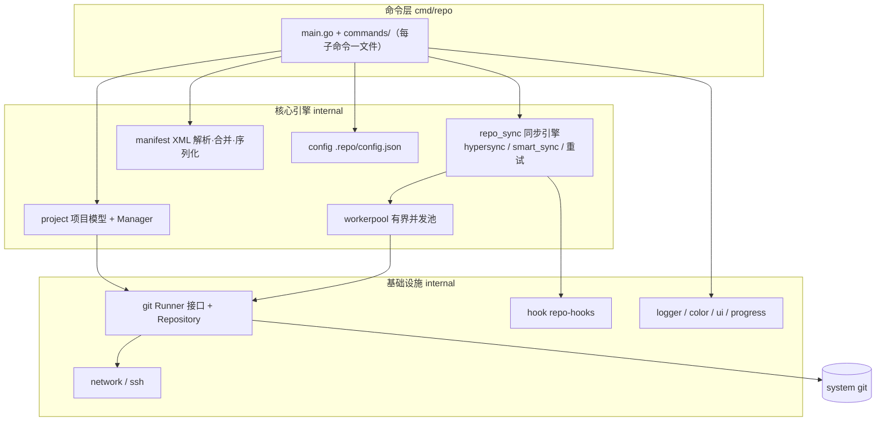

<div align="center">

# repo-go

**Google Git-Repo 的高性能 Go 实现 —— 用一个静态二进制管理数百个 Git 仓库**

一个命令拉起整个多仓库工作区：`init` · `sync` · `start` · `upload` · `forall` · `smartsync` …

[](https://github.com/leopardxu/repo-go/actions/workflows/ci.yml)
[](https://goreportcard.com/report/github.com/leopardxu/repo-go)
[](https://pkg.go.dev/github.com/leopardxu/repo-go)
[](./LICENSE)


[简体中文](./README.md) | [English](./README.en.md)

</div>

---

## 为什么选择 repo-go

[Google `repo`](https://gerrit.googlesource.com/git-repo) 是 Android/AOSP 及众多大型多仓库项目的标准工作流工具，但它是 Python 实现的启动器 + 脚本集，在 Windows 与无 Python 环境下部署麻烦。**repo-go 用 Go 重新实现了整套多仓库管理体验**：

- 🚀 **单一静态二进制** —— 无 Python 运行时、无依赖文件，`go install` 即用，CI 容器友好
- 🪟 **原生跨平台** —— Linux / macOS / Windows 原生支持，告别 Windows 上配置 Python + git-bash 的折腾
- 🔁 **语义对齐上游** —— 除 `init` 外所有子命令与上游 Python `repo` 用户可见行为一致，manifest XML 全要素支持（`extend-project` / `remove-project` / `repo-hooks` / `superproject` / `copyfile` / `linkfile` …）
- ⚡ **并发同步引擎** —— 基于 workerpool 的有界并发，`--jobs` / `--jobs-network` / `--jobs-checkout` 精细控制 fetch 与 checkout 并行度，失败自动退避重试
- 🧩 **增强特性** —— 超集能力：`hypersync`、`smartsync`、superproject、manifest 自定义 XML 属性（上游不支持）、`selfupdate`
- 🧪 **质量保障** —— CI 全量竞态检测（`go test -race`）、golangci-lint、gofmt 门禁

## 安装

```bash
# 方式一：go install（需 Go 1.23+）
go install github.com/leopardxu/repo-go/cmd/repo@latest

# 方式二：源码构建
git clone https://github.com/leopardxu/repo-go.git
cd repo-go && make build    # 产物 bin/repo

# 方式三：从 Release 下载对应平台的预编译二进制
# https://github.com/leopardxu/repo-go/releases
```

> 运行时唯一依赖：系统 `git`（repo-go 通过调用系统 git 完成实际操作）。

## 快速上手

```bash
# 1. 初始化工作区（克隆 manifest 仓库，生成 .repo/ 目录）
repo init -u https://android.googlesource.com/platform/manifest -b main

# 2. 同步全部项目（并发 fetch + checkout，进度条实时显示）
repo sync

# 3. 开始开发：一键为相关项目创建特性分支
repo start my-feature

# 4. 日常多仓库操作
repo status                          # 所有项目的脏文件一览
repo diff                            # 跨项目 diff
repo forall -c 'git gc'              # 对每个项目执行任意 shell 命令
repo grep TODO                       # 跨项目搜索

# 5. 提交评审（Gerrit 工作流）
repo upload
```

自定义你的项目结构：编写一份 manifest XML 声明 remotes 与 projects，即可用同一套命令管理任意多仓库工程（微服务 monorepo、SDK 多仓、私有平台等）。

```xml
<?xml version="1.0" encoding="UTF-8"?>
<manifest>
  <remote name="origin" fetch="ssh://git@example.com/" review="https://gerrit.example.com"/>
  <default remote="origin" revision="main"/>
  <project name="platform/app" path="app"/>
  <project name="platform/libs/common" path="libs/common"/>
</manifest>
```

## 子命令

| 命令 | 用途 |
| --- | --- |
| `init` | 初始化 repo client 工作区（克隆 manifest 仓库） |
| `sync` | 同步工作区到最新 revision（支持 `--jobs` 并发、mirror、archive） |
| `smartsync` | 同步到最近已知可用版本（manifest-server） |
| `start` / `checkout` | 批量创建 / 切换特性分支 |
| `status` / `diff` / `grep` / `overview` | 跨项目状态、差异、搜索、未推送工作总览 |
| `upload` / `download` | Gerrit 代码评审上传 / 拉取他人变更 |
| `forall` | 对每个项目执行 shell 命令（支持并行） |
| `rebase` / `cherry-pick` / `prune` / `abandon` / `stage` | 批量分支维护 |
| `branches` / `list` / `info` / `manifest` / `diffmanifests` | 工作区与 manifest 检查 |
| `selfupdate` / `version` | 自更新与版本查询 |

<details>
<summary>完整用法（<code>repo &lt;command&gt; --help</code> 查看全部旗标）</summary>

```text
abandon          [--all | <branchname>] [<project>...]
branches         [<project>...]
checkout         <branchname> [<project>...]
cherry-pick      <commit> [<project>...]
diff             [<project>...]
diffmanifests    manifest1.xml [manifest2.xml]
download         [<project>...] [<change>...]
forall           [<project>...] -c <command> [<arg>...]
grep             <pattern> [<project>...]
info             [-dl] [-o [-c]] [<project>...]
init             [options] [manifest url]
list             [-f] [<project>...]
manifest         (inspection utility)
overview         [<project>...]
prune            [<project>...]
rebase           {[<project>...] | -i <project>...}
smartsync        [<project>...]
stage            [<project>...] [<file>...]
start            <branch_name> [<project>...]
status           [<project>...]
sync             [<project>...]
upload           [--re --cc] [<project>...] [<branch>...]
```

</details>

## 架构



分层设计：命令层只做参数解析与编排；同步引擎与清单解析各自独立可测；所有 git 子进程经 `git.Runner` 接口集中管理（重试 / trace / 超时 / 并发），测试中以接口 mock。详细说明与数据流图见 **[docs/architecture.md](./docs/architecture.md)**。

## 与上游 repo 的对比

| 维度 | Google repo（Python） | repo-go |
| --- | --- | --- |
| 分发形态 | Python 启动器 + 脚本集 | 单一静态二进制 |
| Windows | 需配置 Python 环境 | 原生支持，`build-windows` 开箱即用 |
| 子命令语义 | 官方基准 | 除 `init` 外逐一对齐上游行为 |
| manifest 解析 | 全要素 | 全要素 **+ 自定义 XML 属性**（`CustomAttrs`） |
| 并发模型 | sync 支持 `--jobs` | workerpool 有界并发，`--jobs-network` / `--jobs-checkout` 细分控制 |
| hypersync / smartsync / superproject | 支持 | 支持 |
| 测试 | — | `go test -race` 全量竞态检测 |

**已知差异（`init`）**：repo-go 是单二进制设计，`init` 不再克隆上游的 launcher 仓库（`.repo/repo/`），只克隆 manifest 仓库并写入 `.repo/config.json` + `.repo/manifest.xml`；`--repo-url` / `--repo-rev` 等旗标接受但忽略（带警告）。其余子命令行为与上游一致。

## 环境变量

所有配置项均可被 `REPO_` 前缀的环境变量覆盖（旧 `GOGO_*` 前缀已废弃）：

| 变量 | 作用 |
| --- | --- |
| `REPO_TRACE=1` | 跟踪 git 命令执行（`--trace` 自动设置） |
| `REPO_LOG_FILE=<path>` | 将调试日志重定向到文件 |
| `REPO_MANIFEST_URL` / `REPO_MANIFEST_BRANCH` / `REPO_MANIFEST_NAME` | `init` 参数的环境变量形式 |
| `REPO_GROUPS` / `REPO_PLATFORM` / `REPO_DEPTH` | 同步过滤与浅克隆深度 |
| `REPO_MIRROR` / `REPO_ARCHIVE` / `REPO_MIRROR_LOCATION` | 镜像 / 归档模式与 `--reference` 回退 |
| `REPO_SYNC_TARGET=<target>` | `smartsync` 目标（缺省回退 AOSP 的 `TARGET_PRODUCT`/`TARGET_BUILD_VARIANT`） |
| `REPO_SELFUPDATE_URL=<url>` | `selfupdate` 默认下载地址 |
| `REPO_GIT_LFS=<bool>` | `--git-lfs` 回退 |
| `NO_COLOR=1` | 禁用彩色输出（`--color never` 自动设置） |

## 文档

- [架构设计](./docs/architecture.md) —— 分层架构、同步数据流、设计决策
- [Manifest 自定义属性](./docs/custom_attributes.md) —— `CustomAttrs` 扩展的用法与序列化行为
- [贡献指南](./CONTRIBUTING.md) —— 开发环境、代码规范、门禁要求
- [安全策略](./SECURITY.md) —— 漏洞私密报告流程

## 贡献

欢迎 Issue 与 PR！提交前请确认门禁全绿（`gofmt` / `go vet` / `go test -race` / `go build`），规范见 [CONTRIBUTING.md](./CONTRIBUTING.md)。

## 许可证

[Apache License 2.0](./LICENSE)

## 免责声明

repo-go 是独立的开源实现，与 Google 无隶属或背书关系。Google `repo` 是 Google 的作品，遵循其自身的开源许可。
