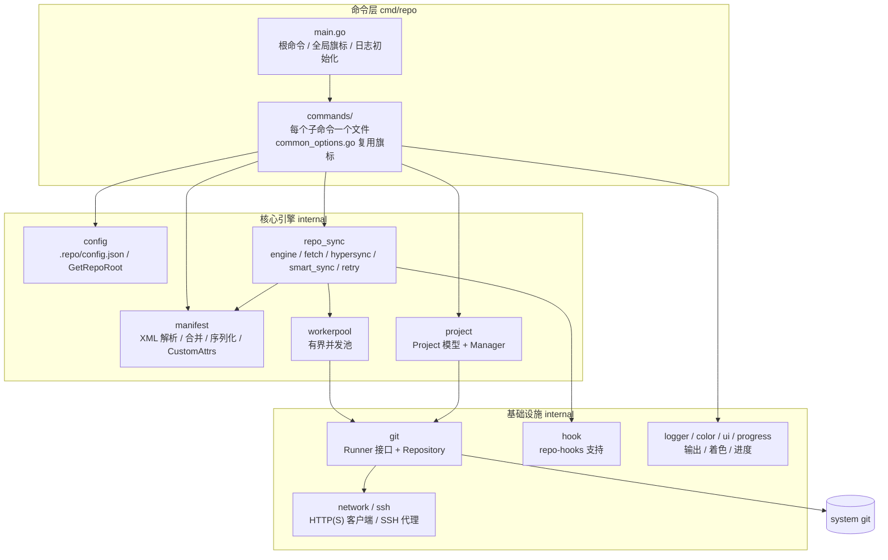
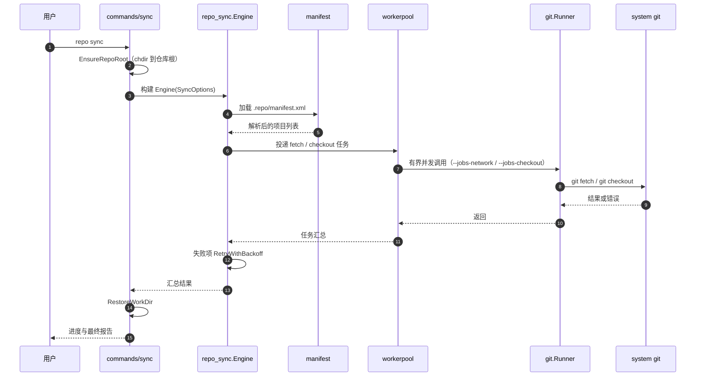

# 架构设计 Architecture

本文描述 repo-go 的整体架构、同步数据流与关键设计决策。代码即真相：实现与本文冲突时以代码为准。

## 1. 总体架构

repo-go 是一个单二进制 CLI：命令层解析参数并编排，核心引擎（同步 / 清单 / 项目模型）完成多仓库管理，所有 git 子进程经由 `git.Runner` 接口统一执行。



### 包职责

| 包 | 职责 |
| --- | --- |
| `cmd/repo` | cobra 根命令与全局旗标（`--trace`、`--color`、`--paginate`、`--event-log` 等），注册全部子命令 |
| `cmd/repo/commands` | 每个子命令一个文件；`common_options.go` / `common_utils.go` 承载跨命令旗标与辅助逻辑；`EnsureRepoRoot` / `RestoreWorkDir` 保证命令在仓库根目录执行 |
| `internal/config` | `.repo/config.json` 与 `.repo/` 目录处理；`ApplyEnvironment()` 把 `REPO_*` 环境变量应用到默认配置 |
| `internal/manifest` | manifest XML 的解析、include 合并、自定义属性（`CustomAttrs`）、`ToXML` 序列化；错误类型 `ManifestError{Op, Path, Err}` |
| `internal/project` | `Project` 模型与 `Manager`：项目定位、按路径/分组过滤 |
| `internal/repo_sync` | 同步引擎：任务编排（`engine.go`）、fetch（`fetch.go`）、`hypersync` / `smart_sync`、`superproject`、`RetryWithBackoff` 重试 |
| `internal/workerpool` | 有界并发池，同步与 `forall` 共用 |
| `internal/git` | `Runner` 接口（`Run` / `RunInDir` / `RunWithTimeout` / `RunInDirWithTimeout`）与 `Repository`；集中重试、trace、并发信号量、超时 |
| `internal/network` / `internal/ssh` | HTTP(S) 客户端与 SSH 代理 |
| `internal/hook` | manifest `<repo-hooks>` 支持 |
| `internal/logger` / `color` / `ui` / `progress` | 结构化日志（`SetLogger` 模式）、着色（`NO_COLOR`）、交互 UI 与进度条 |

## 2. 同步数据流

以 `repo sync` 为例，展示一次典型多仓库同步的调用链：



要点：

- **取消传播**：`sync` 派生可取消的 `context.Context`，fail-fast 或用户中断会沿 workerpool 中断在途任务。
- **重试分层**：引擎内 Runner 重试关闭，重试统一由引擎层 `RetryWithBackoff` 负责，避免叠加重试。
- **进度反馈**：`progress` 包在有多个 worker 时渲染聚合进度，`ui`/`color` 遵循 `NO_COLOR` 与 TTY 检测。

## 3. 工作区状态布局

```
<client-root>/
├── .repo/
│   ├── config.json      # 客户端配置（config 包读写）
│   ├── manifest.xml     # 已解析合并的 manifest（init 产出）
│   ├── manifests/       # manifest 仓库检出
│   └── project-objects/ # 各项目 bare 对象库（上游布局）
└── <project paths>/     # 各项目工作树
```

## 4. 关键设计决策

### 4.1 git 访问只走 `git.Runner`

禁止在 `git` 包之外直接 `exec.Command("git", ...)`。收益：

- 重试、超时、trace、并发信号量集中实现，一处生效；
- 测试用接口 mock，不启动真实子进程（table-driven 测试即秒级完成）；
- `--trace` / `REPO_TRACE=1` 能可靠输出所有 git 调用轨迹。

### 4.2 有界并发（workerpool）

多仓库操作天然并行，但无界 goroutine 会打爆网络与磁盘。所有批量并发（sync、forall）统一走 `internal/workerpool`，由 `--jobs` / `--jobs-network` / `--jobs-checkout` 控制上限。

### 4.3 日志：包级 logger + SetLogger

每个包持有包级 `log logger.Logger`（初值 `NewDefaultLogger()`）并暴露 `SetLogger(...)`；根命令用 `logger.SetGlobalLogger` 设置全局级别后逐一注入。级别：`Error < Warn < Info < Debug < Trace`，`--trace` 置 `LogLevelTrace` 并导出 `REPO_TRACE=1`，`REPO_LOG_FILE` 可重定向到文件。

### 4.4 错误类型：`XxxError{Op, Path, Err}` + `Unwrap()`

如 `manifest.ManifestError`、`config.ConfigError`、`git.GitCommandError`。统一形态保证 `errors.Is` / `errors.As` 可用，调用方按 `Op`/`Path` 精确分流；包装一律 `fmt.Errorf("context: %w", err)` 保持链路。

### 4.5 命令执行位置：`EnsureRepoRoot` / `RestoreWorkDir`

上游 repo 所有子命令都以 client 根目录为基准。命令入口先 `EnsureRepoRoot`（定位 `.repo/` 并 chdir），`defer RestoreWorkDir` 恢复，避免相对路径错位。

### 4.6 `init` 的单二进制例外

上游 `repo init` 会先克隆 launcher 仓库再自举；repo-go 不需要自举，因此 `init` 只克隆 manifest 仓库并写入 `.repo/config.json` + `.repo/manifest.xml`。上游的 `--repo-url` / `--repo-rev` / `--no-repo-verify` 等旗标被接受但忽略（带警告），保证脚本兼容。其余子命令对齐上游语义。

### 4.7 环境变量统一 `REPO_` 前缀

`config.ApplyEnvironment()` 将 `REPO_MANIFEST_URL`、`REPO_DEPTH` 等映射为默认值，旧 `GOGO_*` 前缀已废弃不再支持。

## 5. 测试策略

- **单元测试**：table-driven + `t.Run` 命名子测试；git 交互全部经 `Runner` 接口 mock。
- **竞态检测**：CI 以 `go test -race -count=1 ./...` 全量运行。
- **静态门禁**：`gofmt -l`（必须空）、`go vet`、golangci-lint v2。
- **语义对齐验证**：改动子命令行为时对照上游 Python repo 的语义（上游行为是官方基准）。
